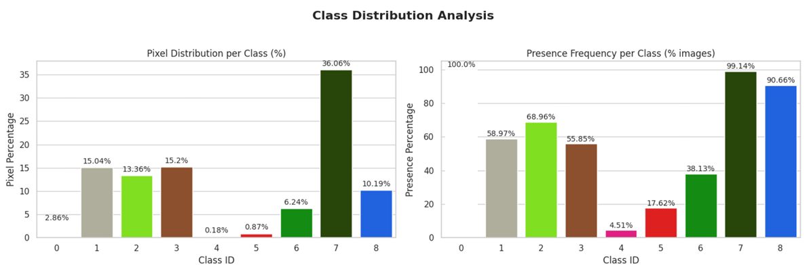
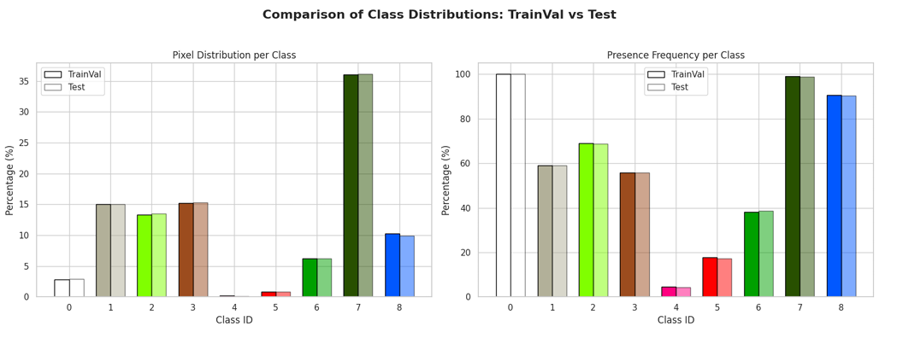
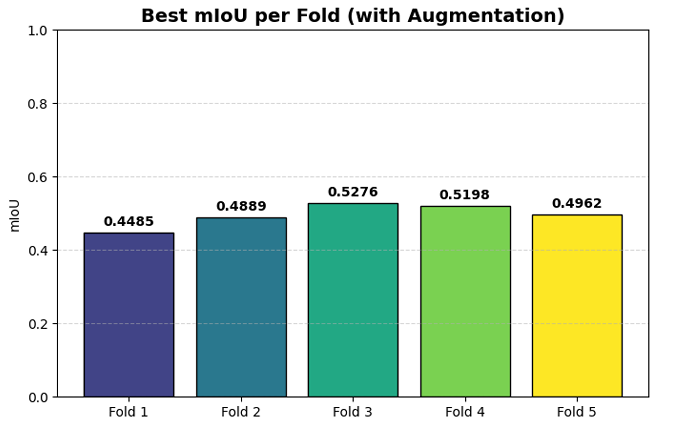
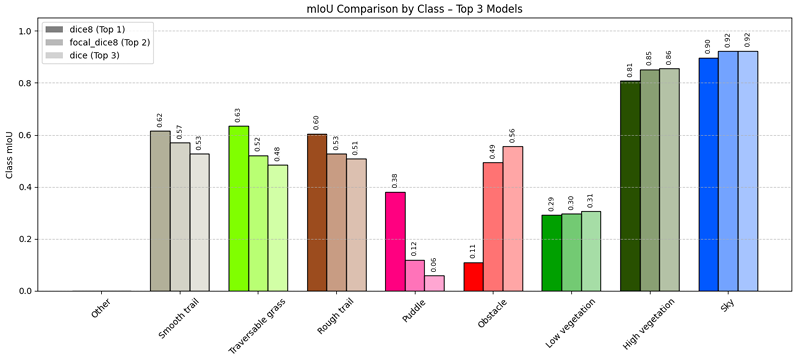
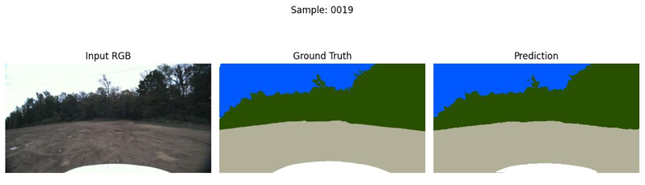
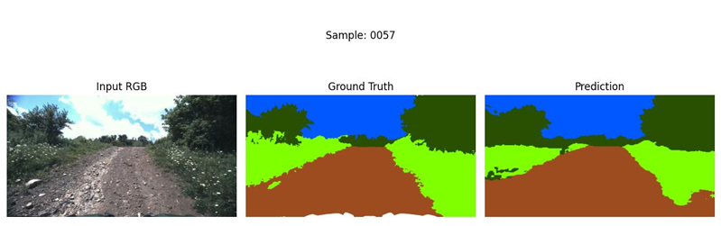
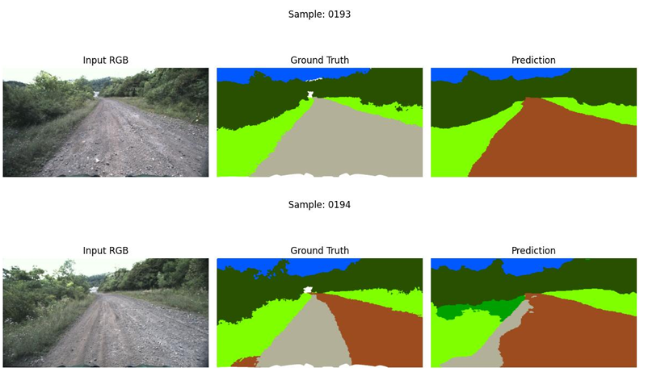

# Autoencoder-based Onboard Image Segmentation

### Machine Learning Project Work 2024/2025 – Group 14 (AH)

**Authors:** Salvatore Coppa – Antonio Graziosi
**University of Salerno – MSc in Computer Engineering**

---

## 🔍 Project Overview

This project focuses on semantic image segmentation for real-time autonomous navigation in rural environments.
Given RGB images acquired from a front-facing onboard camera, the model classifies each pixel into one of **8 semantic classes** (trail types, vegetation, puddles, obstacles, sky).

The goal is to design a **compact and efficient segmentation model** suitable for deployment on resource-constrained embedded systems.

---

## 📊 Dataset

The dataset contains paired **RGB images** and **pixel-level segmentation masks** (PNG).
Each pixel belongs to one of the following classes:

| ID | Class                          |
| -- | ------------------------------ |
| 0  | Other                          |
| 1  | Smooth Trail                   |
| 2  | Traversable Grass              |
| 3  | Rough Trail                    |
| 4  | Puddle                         |
| 5  | Obstacle                       |
| 6  | Non-Traversable Low Vegetation |
| 7  | High Vegetation                |
| 8  | Sky                            |

``

---

## 📈 Dataset Analysis

A detailed analysis was performed to evaluate:

* **Pixel distribution per class**
* **Class presence frequency**
* **Imbalance issues**
* **Train/Val/Test split quality**
* **K-Fold distribution consistency**



To mitigate severe imbalance (e.g., Puddle, Obstacle), we designed tailored augmentation and used a Dice-based loss.

---

## 🧪 Data Splitting Strategy

* **90%** → train + validation
* **10%** → held-out test set
* Custom **greedy split** ensures class distribution consistency
* **5-Fold Cross-Validation** on the TrainVal set



---

## 🛠️ Methodology

### ✔️ 1. Preprocessing & Augmentation

Two augmentation strategies:

#### **Global Random Augmentations (Albumentations):**

* Brightness / contrast / gamma
* Sharpening
* CLAHE
* Color jitter
* Horizontal flip

#### **Targeted Rare-Class Augmentation:**

* Crops around underrepresented classes (Puddle, Obstacle)
* Optional flips
* Stored for reproducibility

``

---

### ✔️ 2. Network Architecture

We implemented **DeepLabV3+** with a **MobileNetV3-Large** encoder:

* Lightweight backbone for realtime inference
* ASPP for multi-scale context aggregation
* Decoder with skip connections for spatial detail recovery


 * DiceLoss
```

Later experiments showed that **Dice Loss alone** or **Focal-Dice Loss** achieved better results—particularly for rare classes.

---

## 🧠 Training Strategy

* Optimizer: **Adam**
* Learning rates:

  * Encoder: 1e-4
  * Decoder: 1e-4
* Batch size: 4 → later increased to 8
* Learning rate scheduling (future work: ReduceLROnPlateau)
* Multi-stage progressive fine-tuning:

  1. Frozen encoder
  2. Partial unfreeze
  3. Full unfreeze with reduced LR

Training was executed on **Google Colab (5GB GPU RAM)** with strict resource constraints.

---

## 🧪 Results

### 📉 Quantitative Evaluation

Metric: **mean Intersection-over-Union (mIoU)**

Best results (test set):

* **Dice8 model** → mIoU = **0.4650**
* **Focal-Dice8 model** → mIoU = **0.4666**







---

### 👁️ Qualitative Results

The model accurately segments major terrain classes and handles illumination changes well.





---

## ⚠️ Annotation Issues

Dataset contains inconsistencies for visually similar scenes (e.g., same trail labeled differently as Smooth vs Rough Trail), affecting quantitative metrics.



---

## 🧩 Misclassification Analysis

Frequent issues:

* **Puddle** ↔ **Trail** misclassification under shadows
* **Obstacle** confusions with vegetation
* Difficulty with small objects and irregular boundaries

---

## 🏁 Conclusion

We developed a resource-efficient DeepLabV3+ model for onboard semantic segmentation in rural settings.
Key achievements:

* Robust pipeline with data augmentation
* Lightweight backbone suitable for embedded devices
* Improved performance on rare classes using Dice-based losses
* Detailed K-Fold evaluation
* Strong qualitative generalization despite annotation noise

Future improvements:

* Consistency-aware training
* Self-supervised pretraining on rural environments
* Larger crop-based augmentation for rare objects

---

## 📂 Repository Structure (Suggested)

```
root/
│ README.md
│ train.py
│ model.py
│ utils.py
│
├─ img/               
├─ dataset/
├─ augmented/
├─ kfold_splits/
└─ results/
```
